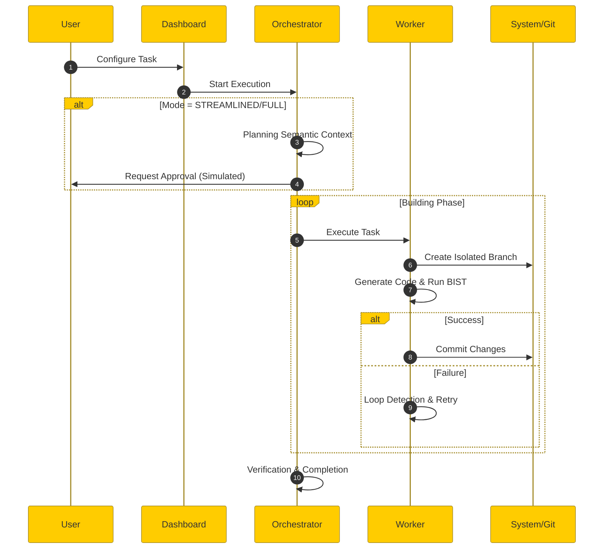

# 📂 HYBRID CONDUCTOR v7.2.8 <!-- omitting version from filename for easier maintenance -->

**Windows-Native LLM Orchestration Framework**
*From Messy Prompt to QA'd Application*

[](https://www.microsoft.com)
[](https://www.python.org)
[](LICENSE)

---

## 🚀 Executive Summary

Hybrid Conductor is a **self-correcting, Windows-native AI coding agent** that transforms ambiguous prompts into fully tested applications. Unlike standard "chat with code" tools, it operates on a hybrid control model:

1.  **You configure it upfront** (Complexity, Constraints, Goals).
2.  **It executes autonomously** (Planning → Building → Verifying).
3.  **You steer mid-flight** if needed (Pause, Checkpoint, Rollback).

It is built specifically for **Windows** environments, with **no dependency on WSL, Docker, or Linux subsystems**.

---

## ✨ Key Features

- **🤖 Autonomous Code Generation:** Transforms natural language prompts into working code without manual intervention.
- **🛡️ Multi-Layer Loop Breaking:** Implements the "Rick Protocol" with SHA-256 hash detection to prevent infinite loops.
- **🔍 Semantic Context Retrieval:** Uses Openground with embedded LanceDB for intelligent context search.
- **🔀 Hybrid Control Model:** Explicit configuration + autonomous execution + mid-flight steering.
- **🧪 Built-In Self-Test (BIST):** Automatic verification prevents broken code commits.
- **🔒 Windows-Native Security:** Zero WSL/Docker dependencies; all operations in user-space; localhost-only network binding.
- **📊 Real-Time Dashboard:** Flask-based UI for live monitoring and steering.

---

## ⚡ Quick Start Guide

### 1. Prerequisites

- **OS**: Windows 10/11 (Native)
- **Python**: Version 3.11 or higher
- **Git**: Installed and in your PATH

### 2. Installation

Open PowerShell or Command Prompt in the project root:

```powershell
python setup.py
```

This script will:
- ✅ Validate your Windows environment.
- ✅ Install dependencies (Flask, Openground, etc.) to user-space.
- ✅ Initialize the local Git repository.
- ✅ Create necessary SQLite databases and folders.

### 3. Launching the System

**Option A: The Dashboard (Recommended)**
Best for visual monitoring and interactive configuration.

```powershell
python dashboard/app.py
```
*Then open your browser to:* `http://127.0.0.1:5000`

**Option B: CLI / Headless**
Best for automation or quick tasks.

```powershell
python orchestrator.py --prompt "Create a snake game" --complexity fast
```

---

## 🕹️ Interaction & Usage

### 1. Configuration & Modes

Choose the **Complexity Mode** that fits your task:

| Mode | Best For | Behavior |
| :--- | :--- | :--- |
| **FAST** 🐇 | Quick fixes, typos, one-file changes | Skips Planning. Goes straight to Building. Max 3 iterations. |
| **STREAMLINED** 🚄 | Feature additions, refactoring | **(Default)** Minimal Spec + TDD workflow. Balanced rigor. |
| **FULL** 🦍 | New projects, complex architecture | Heavy Specification phase. Strict Verification gates. |

### 2. The Dashboard

Access at `http://127.0.0.1:5000`.

- **Config Page**: Set your prompt and complexity mode.
- **Monitor Page**: Watch real-time logs and AI reasoning.
- **History**: View past runs.

> **Security Note**: The dashboard binds ONLY to `127.0.0.1`. It is not accessible from other machines.

### 3. Mid-Flight Steering

Even while the AI runs autonomously, you can issue commands via the Dashboard or by writing to `state/inbox.md`:

| Command | Action |
| :--- | :--- |
| `/pause` | **Pauses execution** at the next safe boundary. |
| `/checkpoint` | **Saves current state**. Creates a snapshot you can roll back to. |
| `/rollback` | **Reverts to previous state**. Undoes recent changes. |

---

## 🏗️ Architecture

### System Flow
The system follows a deterministic state machine: **Planning → Building → Verifying**.



*(See [docs/architecture/system_flow.mermaid](docs/architecture/system_flow.mermaid) for full detailed diagram)*

### Core Components

| Component | Responsibility |
| :--- | :--- |
| `orchestrator.py` | **The Brain**: Manages state machine and workflow. |
| `worker.py` | **The Hands**: Executes tasks in isolated Git branches. |
| `dashboard/` | **The UI**: Flask web interface for control. |
| `loop_guardian.py` | **The Watchdog**: Prevents infinite loops via hashing. |

---

## 📂 Project Structure

```text
hybrid_conductor/
├── orchestrator.py      # Main state machine
├── worker.py            # Task executor
├── setup.py             # Installer
├── dashboard/           # Flask app
│   ├── app.py
│   └── templates/
├── state/               # Runtime state (spec.md, plan.md)
├── logs/                # Activity logs (activity.db)
└── docs/                # Documentation
    └── architecture/    # Mermaid diagrams
```

---

## 🛠️ Troubleshooting

**Q: "Git not found" error?**
A: Ensure standard Git is installed and in your System PATH. The system uses it for local version control.

**Q: Dashboard not loading?**
A: Support is strictly for `127.0.0.1`. Ensure port 5000 is free.

**Q: Context retrieval is slow?**
A: First run builds the Openground index. Subsequent runs are faster.

---

## 📜 License

Distributed under the **MIT License**. See `LICENSE` for details.

---

**Version**: 7.2.8 (Windows-Native Release)
