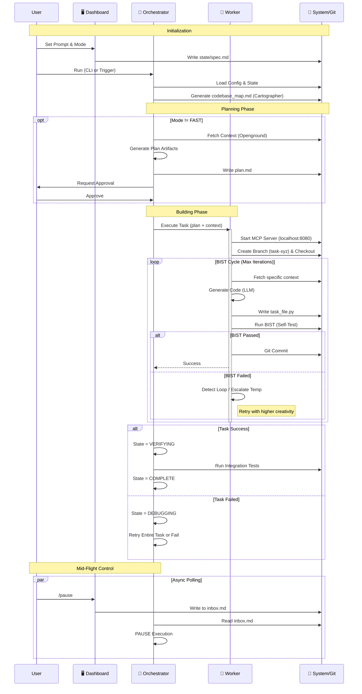

# 📂 HYBRID ORCHESTRATOR v7.2.8

**Windows-Native LLM Orchestration Framework**  
*From Messy Prompt to QA'd Application*

---

## 🚀 Executive Summary

Hybrid Orchestrator is a **self-correcting, Windows-native AI coding agent** that transforms ambiguous prompts into fully tested applications. Unlike standard "chat with code" tools, it operates on a hybrid control model:
1.  **You configure it upfront** (Complexity, Constraints, Goals).
2.  **It executes autonomously** (Planning → Building → Verifying).
3.  **You steer mid-flight** if needed (Pause, Checkpoint, Rollback).

It is built specifically for **Windows** environments, with no dependency on WSL, Docker, or Linux subsystems.

---

## ⚡ Quick Start Guide

### 1. Prerequisites
- **OS**: Windows 10/11 (Native, no WSL required)
- **Python**: Version 3.11 or higher
- **Git**: Installed and in your PATH

### 2. Installation
Open your PowerShell or Command Prompt in the project root and run:

```powershell
python setup.py
```

This script will:
- ✅ Validate your Windows environment.
- ✅ Install dependencies (Flask, Openground, etc.) to user-space.
- ✅ Initialize the local Git repository.
- ✅ Create necessary SQLite databases and folders.

### 3. Launching the System
You can run the system in two ways:

**Option A: The Dashboard (Recommended)**  
Best for visual monitoring and interactive configuration.
```powershell
python dashboard/app.py
```
*Then open your browser to:* `http://127.0.0.1:5000`

**Option B: CLI / Headless**  
Best for quick tasks or automation.
```powershell
python orchestrator.py
```

---

## 🕹️ Interaction & Usage

### The Workflow: State Machine
The system follows a strict, deterministic path to ensure reliability:
1.  **PLANNING 📝**: Generates a `spec.md` (Requirements) and `plan.md` (Checklist).
2.  **BUILDING 🔨**: Writes code in isolated Git branches using a stateless worker.
3.  **VERIFYING ✅**: Runs Built-In Self-Tests (BIST) to validate the code.
4.  **DEBUGGING 🐞**: If verification fails, it auto-retries with clearer thinking (up to 3 times).

### Complexity Modes
Choose the mode that fits your task scope:

| Mode | Best For | Behavior |
| :--- | :--- | :--- |
| **FAST** 🐇 | Quick fixes, typos, one-file changes | Skips Planning. Goes straight to Building. Max 3 iterations. |
| **STREAMLINED** 🚄 | Feature additions, refactoring | **(Default)** Minimal Spec + TDD workflow. Balanced rigor. |
| **FULL** 🦍 | New projects, complex architecture | Heavy Specification phase. Strict Verification gates. |

---

## 🖥️ The Dashboard

Access at `http://127.0.0.1:5000` after running `python dashboard/app.py`.

- **Config Page**: Set your initial prompt and choose your complexity mode.
- **Monitor Page**: Watch real-time logs, current state, and step progress.
- **History**: View past runs and outcomes.

> **Security Note**: The dashboard binds ONLY to `127.0.0.1`. It is not accessible from other machines on your network.

---

## ⌨️ Commanding the Orchestrator

Even while the AI is running autonomously, you remain in control. You can inject commands into the system via the Dashboard or by writing to `state/inbox.md`.

### Available Commands
| Command | Action |
| :--- | :--- |
| `/pause` | **Pauses execution** at the next safe boundary. Useful for inspecting work. |
| `/checkpoint` | **Saves current state**. Creates a snapshot you can roll back to. |
| `/rollback` | **Reverts to previous state**. Undoes recent changes if the AI goes off track. |

---

## 📂 Project Structure

A quick map of where files live:

```text
hybrid_orchestrator/
├── orchestrator.py      # The Brain: Manages states and workflow
├── worker.py            # The Hands: Executes tasks in Git branches
├── setup.py             # The Installer: Sets up your environment
├── dashboard/           # The UI: Flask web server code
├── state/               # 🧠 MEMORY: Where the AI thinks and plans
│   ├── spec.md          # The Project Specification
│   ├── plan.md          # The To-Do List
│   └── inbox.md         # Your Command Queue
├── logs/                # 📝 LOGS: Activity database
└── config/              # ⚙️ CONFIG: Settings (max_iter, timeouts)
```

---

## 🛠️ Troubleshooting & FAQ

**Q: explicit 'Git' error on Windows?**  
A: Ensure Git is installed and added to your System PATH. The system uses a dedicated MCP server for Git to handle Windows paths safely, but it needs the base `git` executable.

**Q: Context retrieval seems slow?**  
A: The system uses **Openground** for semantic search. On first run, it may need to index your codebase. Subsequent runs will be faster. If Openground fails, it falls back to regex scanning, which is robust but dumber.

**Q: Where are my changes?**  
A: The worker performs tasks in **isolated Git branches** (e.g., `task-1234abcd`). This protects your main branch from half-baked code. You must merge them manually or approve the specific PR (if configured).

**Q: How do I stop it immediately?**  
A: Ctrl+C in the terminal window where the orchestrator or dashboard is running. The system is designed to fail safe.

---

**License**: MIT  
**Version**: 7.2.8 (Windows-Native Release)

---

## 📊 Detailed Process Flow

The following diagrams represent the **exact logic** implemented in the core Python files (`orchestrator.py`, `worker.py`, `loop_guardian.py`).

### 1. System State Machine (Orchestrator)
This flowchart maps the deterministic state machine driver found in `orchestrator.py`.

```mermaid
flowchart TD
    Start([User Prompt]) --> Init[Initialize Orchestrator]
    Init --> Cartographer[Cartographer: Map Codebase]
    Cartographer --> CheckMode{Complexity Mode?}
    
    %% Planning Phase
    CheckMode -- FAST --> Building
    CheckMode -- STREAMLINED/FULL --> Planning[State: PLANNING]
    Planning --> GenSpec[Generate Spec & Plan]
    GenSpec --> WaitApproval[Wait for User Approval]
    WaitApproval --> Building[State: BUILDING]
    
    %% Building Phase
    Building --> Worker[Invoke Worker Process]
    Worker --> MCP[Start MCP Git Server]
    MCP --> Branch[Create Isolated Task Branch]
    Branch --> Context[Fetch Context (Openground/Regex)]
    Context --> CodeGen[LLM Code Generation]
    CodeGen --> SaveFile[Atomic File Write]
    SaveFile --> BIST{Run BIST Verified?}
    
    %% Verification & Loops
    BIST -- YES --> Commit[Commit to Branch]
    Commit --> Verifying[State: VERIFYING]
    
    BIST -- NO --> LoopCheck{Loop Detected?}
    LoopCheck -- NO --> RetryCount{Max Iterations?}
    LoopCheck -- YES --> Escalate[Escalate Temperature]
    Escalate --> RetryCount
    
    RetryCount -- NO --> CodeGen
    RetryCount -- YES --> Debugging[State: DEBUGGING]
    
    %% Debugging / Failure
    Debugging --> GlobalRetry{Max Retries?}
    GlobalRetry -- NO --> TempUp[Orchestrator: Bumping Temp]
    TempUp --> Building
    GlobalRetry -- YES --> Failed([State: FAILED])
    
    %% Completion
    Verifying --> Complete([State: COMPLETE])
    
    %% Mid-flight Steering
    subgraph Steering [Inbox Polling]
    Inbox{Command?} -- /pause --> PauseState[Paused]
    Inbox -- /checkpoint --> SaveState[Save Checkpoint]
    end
```

### 2. Interaction Swimlanes
This sequence diagram shows the precise interaction between the User, the Dashboard, the core Orchestrator, the Worker process, and the underlying System/Git layer.


