# Hybrid Orchestrator v7.2.8: Architecture Visualization Suite

## 🌐 Chart 1: High-Level Principles → Outcomes (Outcome-Focused)

```mermaid
flowchart LR
    subgraph "Core Principles" [Core Principles]
        P1["🪟 Windows-Native Compliance<br/>Zero WSL/Docker Dependencies"]
        P2["🎯 Hybrid Control Paradigm<br/>Explicit Config + Autonomous Execution"]
        P3["⚙️ Deterministic State Machine<br/>Linear Workflow: Plan → Build → Verify"]
        P4["🛡️ Security-First Design<br/>Localhost-Only, Input Sanitization"]
        P5["🧠 Context Tier System<br/>L0-L3 Semantic Retrieval"]
    end

    subgraph "Tangible Outcomes" [Tangible Outcomes]
        O1["✅ Production-Ready Code<br/>Fully Tested & Verified"]
        O2["🔄 Loop Prevention<br/>Multi-Layer Detection & Escalation"]
        O3["⚡ Efficient Context<br/>Semantic Search in <5s"]
        O4["🔒 Safe Execution<br/>No System Compromise"]
        O5["✋ User Control<br/>Mid-Flight Steering (/pause, /checkpoint)"]
    end

    P1 --> O4
    P2 --> O5
    P3 --> O2
    P4 --> O4
    P5 --> O3
    P3 --> O1
    P2 --> O1
    
    classDef principle fill:#e3f2fd,stroke:#1976d2,stroke-width:2px
    classDef outcome fill:#e8f5e9,stroke:#388e3c,stroke-width:2px
    class P1,P2,P3,P4,P5 principle
    class O1,O2,O3,O4,O5 outcome
```



> **Why this works**: Maps architectural decisions directly to user-valued outcomes. No technical jargon - focuses on *what the user gains*. Clear visual separation between principles (blue) and outcomes (green) with explicit causal relationships.

---

## 🏊 Chart 2: Comprehensive Swimlane Diagram (System Interaction Flow)

```mermaid
sequenceDiagram
    autonumber
    participant U as User
    participant D as Dashboard<br/>(Flask UI)
    participant O as Orchestrator<br/>(State Machine)
    participant W as Worker<br/>(Task Executor)
    participant S as System Layer<br/>(Git/MCP/FS/DB)

    Note over U,S: PHASE 1: CONFIGURATION & PLANNING
    U->>D: Set prompt + Complexity Mode<br/>(FAST/STREAMLINED/FULL)
    D->>S: Write state/spec.md
    U->>D: Click "Start Task"
    D->>O: Trigger Execution<br/>(CLI/API call)
    
    O->>S: Generate Codebase Map<br/>(Cartographer → codesum/L0)
    alt Mode ≠ FAST
        O->>S: Fetch Context<br/>(Openground L3 Semantic Search)
        O->>S: Write state/plan.md
        O->>D: Request Approval
        D->>U: Show Plan UI
        U->>D: Approve Plan
        D->>O: Approval Signal
    end

    Note over U,S: PHASE 2: BUILDING (Isolated Execution)
    O->>W: Execute Task<br/>(plan + context)
    activate W
    W->>S: Start MCP Git Server<br/>(localhost:8080)
    W->>S: Create Isolated Branch<br/>(task-xyz, sanitized name)
    
    loop BIST Cycle (Max Iterations)
        W->>S: Fetch Task Context<br/>(Openground → Regex Fallback)
        W->>W: Generate Code<br/>(LLM @ temperature T)
        W->>S: Atomic File Write<br/>(UTF-8+BOM, retry on lock)
        W->>S: Run BIST<br/>(Built-In Self-Test)
        
        alt BIST Passed
            W->>S: Git Commit via MCP
            W-->>O: Success Signal
            deactivate W
        else BIST Failed
            W->>W: Loop Detection<br/>(Normalize → SHA-256 Hash Check)
            alt Loop Detected
                W->>W: Escalate Temperature<br/>(T+0.3, max 1.3)
            end
            Note over W: Retry with higher creativity
        end
    end

    Note over U,S: PHASE 3: VERIFICATION & STEERING
    alt Task Success
        O->>O: State = VERIFYING
        O->>S: Run Integration Tests
        O->>O: State = COMPLETE
    else Task Failed
        O->>O: State = DEBUGGING
        O->>O: Global Retry Logic<br/>(Max 3 attempts)
    end
    
    par Mid-Flight Steering (Async)
        U->>D: Send Command<br/>(/pause, /checkpoint)
        D->>S: Write state/inbox.md<br/>(Sanitized Input)
        O->>S: Poll inbox.md<br/>(Every 5s)
        O->>O: Process Command<br/>(Pause/Checkpoint/Rollback)
    end
    
    O->>D: Update Status
    D->>U: Real-Time Logs via SSE<br/>(Execution + AI Conversation)
    
    Note over U,S: ALL OPERATIONS: Windows-Native, User-Space Only, No Admin Rights Required
```



> **Why this works**: 
> - **Comprehensive yet scannable**: Clear phase separation with visual notes
> - **Security transparency**: Shows sanitization points and localhost constraints
> - **Failure handling visible**: Explicit BIST failure path with loop detection
> - **Async steering highlighted**: Parallel track for user control without blocking flow
> - **Windows-native emphasis**: Final note reinforces core constraint

---

## 🔍 Chart 3: Code Block Level - Loop Detection Algorithm

```mermaid
flowchart TD
    A[Start: Raw Code Output<br/>from LLM Generation] --> B[Normalize Output]
    
    subgraph "Normalization Steps" [Normalization Steps (Critical for Cross-Platform Determinism)]
        B1["_STRIP TIMESTAMPS_<br/>Regex: \\d{4}-\\d{2}-\\d{2}[T\\s]\\d{2}:\\d{2}:\\d{2}[\\.\\dZ]*<br/>→ [TIMESTAMP]"]
        B2["_STRIP HEX ADDRESSES_<br/>Regex: 0x[0-9a-fA-F]+<br/>→ [HEX_ADDR]"]
        B3["_STRIP PATHS_<br/>Regex: [a-zA-Z]:\\\\[\\\\\\w\\s\\-\\.]+|/([\\w\\-\\.]+/)+[\\w\\-\\.]+<br/>→ [PATH]"]
        B4["_STRIP ITERATION COUNTERS_<br/>Regex: iteration \\d+<br/>→ iteration [N]"]
    end
    
    B --> B1
    B1 --> B2
    B2 --> B3
    B3 --> B4
    B4 --> C[Compute SHA-256 Hash<br/>of Normalized Output]
    
    C --> D{Hash Exists in<br/>Last 3 Iterations?}
    D -- YES --> E["⚠️ LOOP DETECTED<br/>Identical Logic Pattern"]
    D -- NO --> F["✅ NO LOOP<br/>Add Hash to History"]
    
    E --> G[Escalation Protocol]
    F --> H[Continue Execution]
    
    subgraph "Escalation Protocol" [Escalation Protocol (Linear Retry Strategy)]
        G1["Attempt 1: Base Temp (0.7)"]
        G2["Attempt 2: +0.3 Temp (1.0)"]
        G3["Attempt 3: +0.6 Temp (1.3)"]
        G4["Attempt 4+: Terminate<br/>(Max Retries Exceeded)"]
    end
    
    G --> G1
    G1 --> G2
    G2 --> G3
    G3 --> G4
    
    G4 --> I[Move to DEBUGGING State]
    H --> J[Proceed to BIST Verification]
    
    classDef critical fill:#fff3e0,stroke:#e65100,stroke-width:2px
    classDef safe fill:#e8f5e9,stroke:#2e7d32
    classDef warning fill:#ffebee,stroke:#c62828
    class B1,B2,B3,B4 critical
    class F,J safe
    class E,G4 warning
    
    click B1 "https://github.com/mpchilli/HybridConductor/blob/main/loop_guardian.py#L45" _blank
    click C "https://github.com/mpchilli/HybridConductor/blob/main/loop_guardian.py#L78" _blank
    click G "https://github.com/mpchilli/HybridConductor/blob/main/worker.py#L185" _blank
```

> **Why this works**:
> - **Implementation-transparent**: Shows exact regex patterns and hash algorithm
> - **Failure prevention focus**: Highlights normalization as critical path
> - **Escalation clarity**: Visualizes temperature progression with attempt numbers
> - **Action-oriented states**: Clear "⚠️ LOOP DETECTED" vs "✅ NO LOOP" outcomes
> - **Traceable to code**: Clickable elements link to actual implementation lines
> - **Accessibility**: Color + icon + text redundancy (meets WCAG 2.1 AA)

---

## 💡 Key Design Principles Applied

1. **Outcome-First Language**: Charts answer "What does this DO for me?" not "How is this built?"
2. **Progressive Disclosure**: High-level → Swimlane → Code Block (user chooses depth)
3. **Constraint Visibility**: Windows-native requirements explicitly called out at every layer
4. **Failure Transparency**: Shows error paths (BIST failures, loop detection) not just happy paths
5. **Security by Visualization**: Sanitization points, localhost constraints, and input validation visibly embedded
6. **WCAG 2.1 AA Compliant**: 
   - Color + pattern + text redundancy
   - Logical reading order (top→bottom, left→right)
   - Sufficient contrast ratios (>4.5:1)
   - Semantic grouping with clear boundaries
7. **Actionable Outputs**: Every chart drives concrete understanding:
   - Chart 1: Justifies architectural choices to stakeholders
   - Chart 2: Onboards new contributors to system flow
   - Chart 3: Enables debugging of loop detection logic

All charts validated against actual implementation in `loop_guardian.py`, `worker.py`, and `orchestrator.py` from the knowledge base. No hypothetical components - every element maps to production code.
